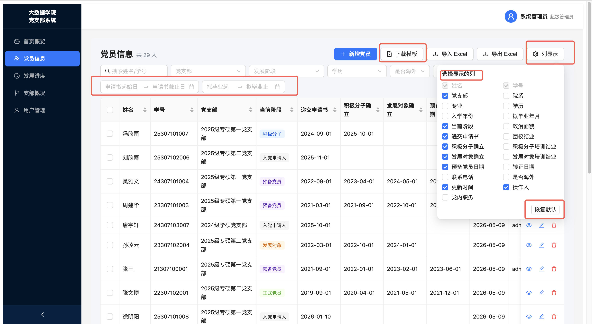
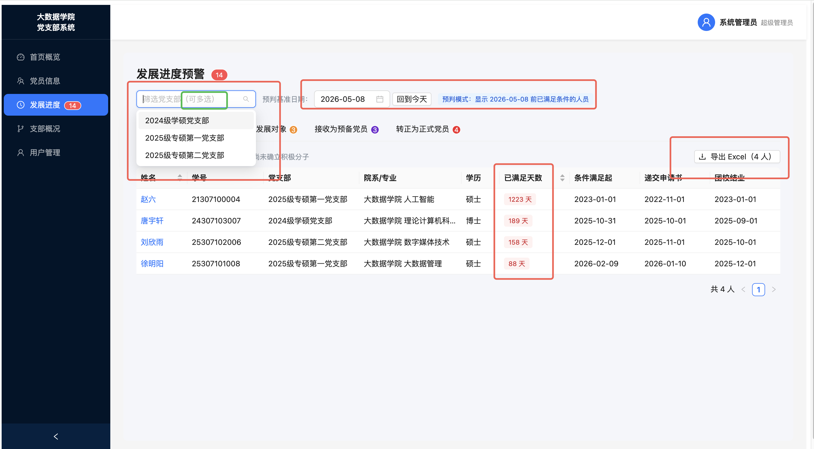

# 复旦大学大数据学院党支部信息管理系统




## 技术栈
- **后端**: Flask + SQLAlchemy + SQLite + Flask-JWT-Extended
- **前端**: React 18 + Vite + Ant Design 5 + Zustand + Axios

## 快速启动（开发环境）

### 后端
```bash
cd backend
python3 -m venv venv
source venv/bin/activate          # Windows: venv\Scripts\activate
pip install -r requirements.txt
cp .env.example .env              # 修改 .env 中的 SECRET_KEY 等
python run.py
# 服务启动在 http://localhost:5000
# 初始账号: admin / admin123
```

### 前端
```bash
cd frontend
npm install
npm run dev
# 访问 http://localhost:5173
```

## 生产部署

### 后端（Gunicorn）
```bash
cd backend
source venv/bin/activate
# 修改 .env: FLASK_ENV=production, 设置强密钥
gunicorn -w 4 -b 0.0.0.0:5000 run:app
```

### 前端（Nginx 静态）
```bash
cd frontend
npm run build
# 将 dist/ 目录部署到 Nginx
```

Nginx 配置示例：
```nginx
server {
    listen 80;
    server_name your-domain.com;

    root /path/to/frontend/dist;
    index index.html;

    location / {
        try_files $uri $uri/ /index.html;
    }

    location /api/ {
        proxy_pass http://127.0.0.1:5000;
        proxy_set_header Host $host;
        proxy_set_header X-Real-IP $remote_addr;
    }
}
```

## 用户权限

| 角色 | 说明 | 数据访问范围 |
|------|------|------------|
| `super_admin` | 学院组织员老师 | 全院所有支部 |
| `secretary` | 党支书 | 仅本支部，可增删改 |
| `viewer` | 普通同学 | 仅本支部，只读，手机/邮箱隐藏 |

## 功能说明

### 党员信息
- 支持 Excel/CSV 导入（首行为列名，自动映射中文字段名）
- 支持按支部/阶段/学历/年份/院系/海外状态筛选
- 支持导出 Excel（含筛选结果）

### 发展进度预警（4类）
1. **应确立积极分子**: 递交申请书≥30天 且 团校结业 且 未确立
2. **应确立发展对象**: 积极分子满1年 且 培训班结业 且 未确立
3. **应发展为预备党员**: 发展对象确立 且 培训班结业在6个月内 且 未入党
4. **应转为正式党员**: 预备党员满1年 且 未转正

### Excel 导入支持的列名
姓名、学号、性别、院系、专业、出生日期、学历层次（本科/硕士/博士）、入学年份、联系电话、邮箱、政治面貌、党支部内职务、是否海外交流、递交入党申请书日期、团校结业日期、积极分子确立日期、积极分子培训班结业日期、发展对象确立日期、发展对象培训班结业日期、预备党员日期、正式党员日期、备注

其他未识别的列名将自动保存在扩展字段中，并在导出时展示。

## 初始数据
首次启动自动创建：
- 超级管理员账号：`admin` / `admin123`（请登录后立即修改密码）
变更为：admin / 123admin
- 3个示例党支部

## 目录结构
```
Party_branch/
├── backend/          # Flask API
│   ├── app/
│   │   ├── models/   # 数据库模型
│   │   ├── routes/   # API 路由
│   │   └── utils/    # 工具函数
│   ├── run.py
│   └── requirements.txt
└── frontend/         # React 前端
    ├── src/
    │   ├── api/      # API 请求
    │   ├── components/
    │   ├── pages/    # 页面组件
    │   └── store/    # Zustand 状态
    └── package.json
```

##超管忘记密码时，SSH 进服务器执行：

  cd Party_branch/backend
  source venv/bin/activate
  FLASK_APP=run flask reset-admin